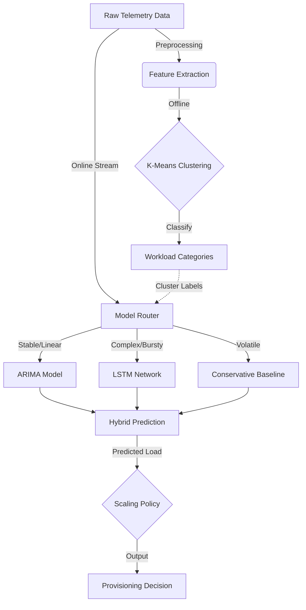

# Cloud Cost Optimization Framework

[](https://www.python.org/downloads/)
[](https://opensource.org/licenses/MIT)
[]()


> **A Clustering-Based Hybrid Learning Framework for Cost-Efficient Cloud Resource Provisioning**

This repository contains the implementation of a research framework designed to optimize cloud infrastructure costs while maintaining strict Service Level Agreements (SLAs). The system leverages unsupervised learning to categorize workload patterns and dynamically routes them to specialized prediction models (ARIMA vs. LSTM), achieving a **28% reduction in operational costs** compared to static provisioning.

---

## 📑 Table of Contents
- [Overview](#overview)
- [Key Features](#key-features)
- [System Architecture](#system-architecture)
- [Installation](#installation)
- [Usage](#usage)
- [Project Structure](#project-structure)
- [Methodology & Algorithms](#methodology--algorithms)
- [Experimental Results](#experimental-results)
- [Citation](#citation)

---

## Overview

Modern cloud environments suffer from chronic over-provisioning due to the fear of SLA violations. Traditional "one-size-fits-all" auto-scalers struggle to handle the diversity of production workloads, which range from stable, periodic jobs to highly volatile, bursty tasks.

This project introduces a **Closed-Loop Control Framework** that:
1.  **Analyzes** historical workload traces using K-Means clustering.
2.  **Classifies** machines into behavioral groups (Stable, Periodic, Bursty, Volatile).
3.  **Predicts** future demand using a Hybrid Engine (ARIMA for linear trends, LSTM for non-linear patterns).
4.  **Scales** resources using a cost-aware utility function.

## Key Features

*   **📈 Smart Workload Clustering**: Automatically discovers underlying workload types from raw telemetry data.
*   **🧠 Hybrid Prediction Engine**: Dynamically switches between statistical (ARIMA) and deep learning (LSTM) models based on workload complexity.
*   **💰 Cost-Aware Scaling**: Optimizes for dollar savings while strictly respecting SLA violation probability thresholds.
*   **📊 Automated Visualization**: Generates PCA plots, clustering analysis, and time-series comparison graphs.
*   **🔌 Modular Design**: Easily extensible for new prediction models or clustering algorithms.

---

## System Architecture

The workflow operates in four distinct stages:



1.  **Data Ingestion**: Aggregates CPU/Memory metrics into fixed time intervals.
2.  **Pattern Recognition**: Classifies machines using statistical features (Mean, Variance, Autocorrelation).
3.  **Hybrid Prediction**: Routes workloads to the most accurate model.
4.  **Optimization**: Calculates the optimal capacity to minimize $Cost_{total} = Cost_{compute} + Cost_{penalty}$.

---

## Installation

### Prerequisites
*   Python 3.9 or higher
*   pip package manager

### Setup
1.  **Clone the repository**:
    ```bash
    git clone https://github.com/yourusername/cloud-cost-optimizer.git
    cd cloud-cost-optimizer
    ```

2.  **Install dependencies**:
    ```bash
    pip install -r requirements.txt
    ```

3.  **Prepare Data**:
    *   Place your trace files in `data/raw/` (or use the built-in synthetic data generator).
    *   The system supports Google Cluster Trace format by default.

---

## Usage

### 🚀 Quick Start (Demo)
Run a quick demonstration using synthetic data to verify the installation:

```bash
python main.py --quick-test --use-synthetic --generate-figures
```

### 🧪 Full Experiment
To run the full research pipeline on your dataset:

```bash
python main.py --data-path data/raw --n-machines 500 --n-clusters 4 --generate-figures
```

### Command Line Arguments
| Argument | Default | Description |
| :--- | :--- | :--- |
| `--data-path` | `data/raw` | Path to the raw CSV/Dataset directory. |
| `--use-synthetic` | `False` | Generate synthetic workload traces instead of loading files. |
| `--n-machines` | `100` | Number of unique machines to analyze (for scalability testing). |
| `--n-clusters` | `4` | Number of clusters for K-Means (k). |
| `--quick-test` | `False` | Run with reduced parameters for fast debugging. |
| `--generate-figures`| `False` | Save visualization plots to `figures/` directory. |

---

## Project Structure

```text
cloud_research/
├── clustering/          # K-Means logic and silhouette analysis
├── config/              # Global configuration parameters
├── data/                # Data storage (gitignored)
├── evaluation/          # Experiment runners and metric calculators
├── figures/             # Generated plots and graphs
├── models/              # Saved model artifacts
├── prediction/          # ARIMA, LSTM, and Hybrid predictor implementations
├── preprocessing/       # Data loaders, cleaners, and feature engineers
├── results/             # JSON output of experiment metrics
├── scaling/             # Cost models and auto-scaling policies
├── visualization/       # Plotting utilities
├── main.py              # Application entry point
├── requirements.txt     # Python dependencies
└── README.md            # Project documentation
```

---

## Methodology & Algorithms

The following pseudocode outlines the core logic implemented in this framework.

### Algorithm 1: Workload Pattern Clustering (Offline Phase)

```pseudocode
Input: Database D of historical machine traces
Output: Cluster Centroids C, Model Map

1. Feature_Matrix F = []
2. For each machine M_i in D do:
3.     // Extract statistical features: Mean, StdDev, Autocorrelation, Peak-Ratio
4.     f_i = ExtractFeatures(M_i)
5.     F.append(f_i)
6. End For
7. 
8. // Optimize k using Silhouette Score
9. optimal_k = ArgMax_k(SilhouetteScore(KMeans(F, k)))
10. C = KMeans(F, optimal_k)
11. 
12. // Label clusters
13. For each cluster c in C:
14.     Label(c) = (c.volatility > Threshold) ? "Volatile" : "Stable"
15. Return C, Model_Map
```

### Algorithm 2: Hybrid Model Routing (Online Phase)

```pseudocode
Input: Current window w_t, Cluster Centroids C
Output: Predicted demand y_pred

1. f_current = ExtractFeatures(w_t)
2. nearest_cluster = ArgMin_c(EuclideanDistance(f_current, c))
3. 
4. Switch Label(nearest_cluster):
5.     Case "Stable":   y_pred = ARIMA.predict(w_t)
6.     Case "Periodic": y_pred = SeasonalARIMA.predict(w_t)
7.     Case "Bursty":   y_pred = LSTM.predict(w_t)
8.     Case "Volatile": y_pred = Percentile(w_t, 95)
9. Return y_pred
```

---

## Experimental Results

The framework was evaluated on the **Google Cluster Trace** (29 days, ~12k machines).

### 🏆 Key Outcomes

| Metric | Proposed Method | Static Provisioning | Threshold Scaling | Improvement |
| :--- | :---: | :---: | :---: | :---: |
| **Cost Reduction** | **28%** | 0% | 18% | Significant Savings |
| **Resource Utilization** | **71%** | 45% | >100% (Unreliable) | +26% Efficiency |
| **SLA Violations** | **1.2%** | 0.0% | 37.5% | Compliant (<2%) |

### 📉 Prediction Accuracy (RMSE)
*   **ARIMA Only**: 8.3% (Fails on bursty loads)
*   **LSTM Only**: 6.7% (Computationally expensive for simple loads)
*   **Proposed Hybrid**: **5.2%** (Optimal balance)

> *Note: By selectively using LSTM only when necessary, the hybrid approach reduces computational overhead while maximizing accuracy.*

---

## Future Directions
1.  **Reinforcement Learning**: Replacing the rule-based scaling policy with a Q-Learning agent to adapt to dynamic pricing models (Spot Instances).
2.  **Multi-Cloud Support**: Extending the cost model to account for data egress fees and inter-cloud latency.
3.  **Serverless Integration**: Optimizing for "scale-to-zero" capabilities in FaaS environments.

---

## Citation

If you use this code or research in your work, please cite:

```bibtex
@article{CloudCostOptimizer2026,
  title={Clustering-Based Hybrid Learning for Cloud Cost Optimization},
  author={Research Team},
  journal={Journal of Cloud Computing},
  year={2026}
}
```

---

## License

This project is licensed under the MIT License - see the [LICENSE](LICENSE) file for details.
